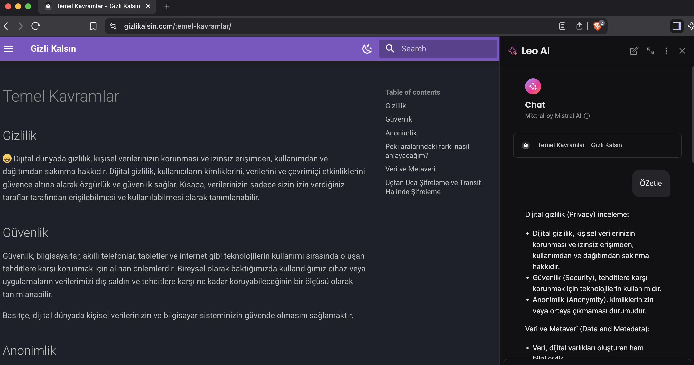
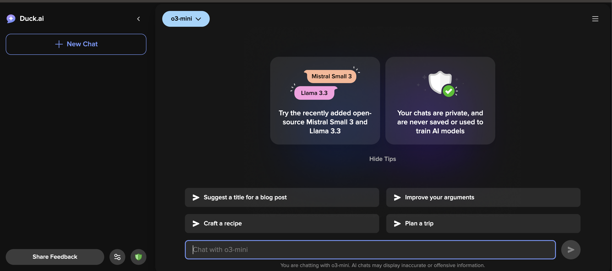
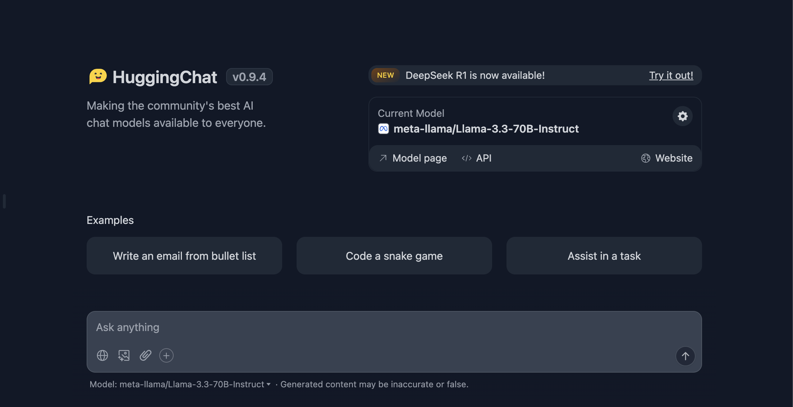

# "ChatGPT'den Kaçış Planı: Veriniz Sadece Sizin Kalsın Diyen Sohbet Botları”

Bugün internette "ücretsiz" dediğimiz her şeyin asıl bedelini bizden nasıl aldığını artık sağır sultan bile biliyor. Özellikle yapay zekâ sohbet botları yani şu akıllı robotlarla konuştuğumuz uygulamalar?

Siz sanıyorsunuz ki bir soru sordunuz, cevap aldınız, kapattınız. Ama arkada o sohbetin, o cümlenin, o merhaba’nın bile bir yerlere kaydedilip didiklendiğini, hatta bunlarla o koca modellerin eğitildiğini bazen unutuyoruz.

İşte bu yazı tam da bu yüzden var: Gizli Kalsın olarak ChatGPT başta olmak üzere "konuşan robotlar" dünyasında gizliliğinizi koruyarak nasıl takılabilirsiniz? Hem yerel (yani tamamen sizin bilgisayarda çalışan) hem de bulut (internet üstünden ama daha az meraklı) seçenekleri bir araya topladık.

Yani hem paranoyaklar hem de temkinliler için menü hazır!

## Yapay Zeka Sohbet Botları ve Gizlilik Kavramı

Yapay Zeka Sohbet Botları (YZSB) veya Büyük Dil Modelleri (LLM'ler), günlük yaşantımızı, iş hayatımızı ve öğrenmeyi kökten değiştirdi. Ancak, bu modellerin kullanımı, verilerinizin uzak sunuculara gönderilmesi, yani başkalarının bilgisayarlarında işlenmesini gerektirdiğinden kim bilir verileriniz kimlerin ellerinden veya cihazlarından geçiyor! 

Mahremiyetten taviz vermeden YZ Sohbet botlarını kullanabilmek  da iki alternatif yol bulunmaktadır:

1. Tamamen cihazınızda çalışan yerel (local) olarak çalışan uygulamalar kullanmak, ya da
2. Ben onunla uğraşamam diyenler için bulut tabanlı çalışan ancak verilerinizi (ç)almayan çözümlere yönelmek.

Öncelikle kolay olandan başlayalım. 

## Bulut Tabanlı Gizlilik Dostu LLM Araçları

Diyelim ki bilgisayarınız biraz yaşlı…

Ya da RAMiniz düşük veya bu yerel modellerin gücü bana yetmiyor diyorsanız, yine bulut tabanlı araçları kullanabilirsiniz. Ancak bir şartla:

Her servis verilerinize aynı saygıyı göstermiyor.

### Öne Çıkan Bulut Tabanlı Seçenekler:

#### [**1. Brave Leo**](https://brave.com/leo/)

- Brave tarayıcısı ile birlikte gelen bu yapay zekâ asistanı, gizliliği merkeze alıyor.
- Sohbet ederken IP adresini maskeleyen özel bir sunucu kullanıyor. Yani sizi siz gibi göstermiyor.
- Konuşmalar yapılıyor, cevap veriliyor ve ardında... hepsi siliniyor. Arkada veri kaydı yok.
- Ücretsiz sürümünde Mixtral Small, Claude Haiku ve Llama 3.1 8B modelleri destekliyor. Ancak ben parasını öderim diyenler için premium menüde Claude Sonnet de var.
- Tek şartı Brave Tarayıcı kullanmak, diğer tarayıcıları kullananlar kusura kalmasınlar.
    
#### [**2. DuckDuckGo AI Chat**](https://duckduckgo.com/duckduckgo-help-pages/duckai)

- DuckDuckGo Arama motoru olarak zaten yıllardır "izlenmeden arama yapmanın yolu" diye kendini tanıtıyor.
- AI Chat servisinde de aynı felsefe ile devam ediyor: IP adresini kendisiyle değiştiriyor, sohbet bilgilerini kaydetmiyor.
- Model sağlayıcılarla anlaşmışlar: Konuşmalar 30 gün içinde uçuyor ve eğitim verisi olarak kullanılmıyor.
- Kullanılan modeller: ChatGPT 4o mini, Claude 3 Haiku, Llama 3.3 70B, Mistral Small 3.
- DuckDuckGo sohbet bilgilerini saklamaz ve model sağlayıcılarla sohbetlerin 30 gün içinde silinmesi ve modellerin eğitiminde kullanılmaması için anlaşmalar yapılmıştır.
- Kullanması en kolay olan araç da bu, adres çubuğuna [duck.ai](http://duck.ai/) adresini girmeniz ve bir model seçmeniz yeterli, tarayıcı farketmiyor.

#### [**3. Hugging Face Chat**](https://huggingface.co/chat/)
    

- Gizlilik Politikası gayet kısa ve net: **"Privacy by Design"**. Yani tasarım aşamasında gizlilik şart koşularak geliştirilmiş. Dolayısıyla, sohbetlerin dışarı sızması, başka amaçla kullanılması yok.
- Hugging Face’in ev sahipliği yaptığı modeller arasında Llama, Deepseek, Qwen, ve Cohere gibi açık kaynak yıldızları var.
- Firefox AI Chat Fonksiyonu ile entegre bir şekilde tarayıcıda ziyaret edilen sayfa hakkında sorulara cevap vermek veya özetlemek gibi amaçlarla kullanmak da mümkün.

- Ekstra özellikler de bol: Web sayfasını özetle, kod yaz, belge oku, hatta kendi özel asistanını oluştur.
- Kullanmak için bir hesap gereklidir, aksi takdirde kullanım hakkınız ciddi bir şekilde sınırlıdır.
- Özel Asistanlar, yani özel GPT'ler oluşturmak mümkündür. Bu sayede kişiselleştirilmiş promptlar ve bilgi kaynakları tanımlayabilir veya topluluk tarafından oluşturulmuş asistanları kullanabilirsiniz.
- Hugging Chat’in Android ve iOS platformlarında da mobil uygulamaları var. Yani cep telefonu üzerinden de rahatça kullanılabiliyor.

### Bulut LLM Araçları İçin Kriterler:

- **Zorunlu**: Kişisel tanımlanabilir bilgileri ChatGPT, Claude gibi sağlayıcılara gönderilmemesi veya gönderilirken anonimleştirilmesi veya rasgeleleştirilmesi.
- **Zorunlu**: Kişisel verilerin veya sohbetlerin model eğitiminde kullanılmaması.
- **Zorunlu:** Gizlilik Politikasında açıkça kişisel bilgilerin toplanmadığı ve model eğitiminde kullanılmadığının veya üçüncü partilerle paylaşılmadığının belirtilmesi
- **Tercihen**: Çoklu platform desteği.
- **Tercihen**: Hesap oluşturmadan modelleri kullanabilmeye izin vermesi.

!!! danger "Uyarı"
    Her ne kadar yukarıdaki kriterler kullanıcılara önemli avantajlar ve korumalar sağlasa da, hiçbir bulut tabanlı yapay zeka aracı kimlik numarası, banka hesabı ve şifreleriniz gibi özel ve hassas verilerinizi paylaşmamalısınız.  

## Yerel YZ Sohbet Botları: Cihaz Üzerinde Çalışan Seçenekler

Ben kurmakla uğraşırım, yeter ki internetsiz ortamda bile şakır şakır çalışsın, ama dedikodunuzu komşuya uçurmasın diyorsanız, buyurun yerel modeller dünyasına.

YZ Sohbet Botları temelde iki bileşenden oluşmaktadır: Dil Modelleri ve bu modellerini çalıştıran uygulamalar. Tavsiye ettiğimiz uygulamalar bilgisayarınızın RAM kapasitesine göre sizlere otomatik olarak uygun dil modellerini örnermekte ve otomatik olarak indirmenize yardımcı olmaktadır.

Meraklıları için Huggingface üzerinden çok daha fazla model bulma, inceleme ve indirebilme seçeneği de mevcut elbette. Dil Modelleri ilgili detaylı karşılaştırmalar için [LM Arena](https://lmarena.ai) ve [OpenLLM Leaderboard](https://huggingface.co/spaces/open-llm-leaderboard/open_llm_leaderboard) gibi kaynakları inceleyebilirsiniz.

!!! information "Ek Bilgi"
    Büyük Dil modellerini ortalama bir bilgisayarda çalıştırabilmek için Nicelleştirilmiş (veya sıkıştırılmış) versiyonları kullanmak gerekmektedir. Genellikle q4 seviyesindeki modeller 8 GB RAM'e sahip bilgisayarlarda iyi sonuçlar verir.

### Popüler Yerel LLM Araçları:

#### [**1. GPT4All**](https://www.nomic.ai/gpt4all)
    
- Nomic AI firması tarafından geliştirilen GPT4ALL en popüler yerel chatbot uygulamalarından birisidir.
- Deepseek R1, LLaMa, Mistral ve Nous-Hermes gibi modelleri destekler.
- GPT4ALL için konfigüre edilmiş modellerin yanında, Hugging Face üzerinden arama yapabilmenize ve uygulamadan ayrılmadan modelleri bilgisayarınıza indirebilmenizi sağlar.
- Yerel Dökümanlarla (Local Docs) çalışma özelliği bulunmaktadır. Eklediğiniz bir klasördeki dökümanlar hakkında soru sorabilir ve sohbet edebilirsiniz.

#### [**2. Llamafile**](https://llamafile.ai/)
    
    - Llamafile, Mozilla tarafından geliştirilmiş bir araçtır ve herhangi bir kurulum gerektirmeden, yalnızca tek bir dosya kullanılarak çalıştırılabilir.
    - Yerel olarak büyük dil modellerini (LLM) çalıştırmayı oldukça basit bir hale getiren bu yenilikçi yaklaşım, kullanıcıların karmaşık kurulum süreçlerinden kurtulmasına olanak tanır.

#### [3. **Jan.ai**](http://jan.ai/)
    
    - Kullanıcı arayüzü açısından en gelişmiş olan uygulama desek yeridir.
    - Ancak, yerel dokümanlarla etkileşim sağlama, modelden soru sorma ve benzeri özellikler beta aşamasındadır ve zaman zaman hata verebilir.

#### [**4. AnythingLLM**](https://anythingllm.com)
    
    - AnythingLLM yerel dökümanların yanısıra veritabanı bağlama gibi ileri düzey özellikler sağlayan bir uygulamadır ve genellikle ileri düzey kullanıcılar için tavsiye edilir.
    
#### [**5. Ollama**](https://ollama.com)
    
    - LLM'leri yerel olarak çalıştırmak için basitleştirilmiş bir komut satırı aracıdır.
    - Çoklu model desteği ve multimodal yetenekleri ile metin, görüntü ve diğer veri türleriyle çalışabilir.
    - Hızlı başlatma süresi ve düşük kaynak kullanımına sahiptir
    - Bir kullanıcı arayüzü bulunmamaktadır ve bilgisayar terminali üzerinden kullanılabilir. İstenildiği takdirde çeşitli kullanıcı arayüzleri Ollama ile entegre olarak kullanılabilir.

### Yerel LLM Araçları İçin Kriterler:

- **Zorunlu**: Cihaz Üzerinde Veri İşleme ve Çevrimdışı (Offline) Çalışabilme.
- **Zorunlu**: Uygulamanın açık kaynaklı olması
- **Zorunlu**: Varsayılan olarak sohbet verileri dahil kişisel verileri toplanmaması.
- **Zorunlu**: Çoklu Platform desteği
- **Tercihen**: Bilgisayardaki dosyalar ve istenildiğinde veritabanları ile entegrasyon sağlanması.

## Model Eğitiminde Veri Endişeleri

Büyük dil modelleri dediğimiz şey, adından da belli — büyük veriyle besleniyor. Bazıları diyor ki biz bu verileri vermesek bu modeller oluşmaz.

Öncelikle bu dert, daha çok o modelleri geliştiren dev şirketlerin meselesi. Kullanıcı olarak bizim kaygılanmamız gereken konu, verilerimizin bu sofrada nasıl kullanıldığı.

İkincisi, biz fanilerden toplanan veriler deryada damla, yani zorunluluktan değil sadece "Ücretsiz" yazan tabelanın arkasında genelde veriyle ödeme yazdığından kaynaklanıyor.

Tabii ücretli servislerde de veri toplanabiliyor — orası ayrı mesele. Ama şu önemli: Siz verilerinizi koruyunca dünya durmuyor, teknoloji gelişmeyi bırakmıyor. 

## Yine de başka bir YZ Sohbet Botu Kullanması Gerekenler için Bazı Öneriler

- Kullandığınız her hizmetin **gizlilik politikasını dikkatlice inceleyin**. Hangi verilerin toplandığını, ne amaçla saklandığını ve kimlerle paylaşıldığını mutlaka öğrenin.
- Eğer kayıt olmanız gerekiyorsa, şahsi e-posta adresiniz yerine bir [e-posta](https://simplelogin.io/tr/) takma adı kullanın ve cep telefonunuzu paylaşmayın. 
- Verilerinizin dil modellerinin **eğitiminde** kullanılmasına izin vermeyin. (Bazı sağlayıcılar seçimi kullanıcılara bırakmaktadır.)
- **Uygulama izinlerini inceleyin** ve toplanmasına izin verdiğiniz verileri sınırlayın. Mümkünse uygulamalar yerine tarayıcı tabanlı siteler üzerinden erişin.
- Yerel ve bulut çözümleri arasında karar verirken paylaştığınız **verilerin hassasiyetini göz önünde bulundurun**. **Örneğin;** sağlık ve hastalık ile ilgili bilgileriniz ile ödev yaparken merak ettiğiniz konular farklı hassasiyet seviyesine sahip.
- İş, araştırma veya kişisel konuşmalar gibi farklı LLM etkileşimler için **ayrı profiller veya modeller kullanın**.
- IP Adresinizi gizlemek için **VPN kullanın**.

## Sonuç

Gizliliğe önem veren büyük dil modeli (LLM) çözümleri her geçen gün gelişiyor ve çeşitleniyor. Hem yerel hem de bulut tabanlı seçenekler, kullanıcı ihtiyaçlarına göre daha esnek ve güvenli hale geliyor.

Yerel çözümler — örneğin GPT4All, Llamafile, [Jan.ai](http://Jan.ai) veya AnythingLLM — verilerinizin tamamen cihazınızda işlenmesini sağlayarak maksimum gizlilik sunar.

[**Brave Leo**](https://brave.com/leo/) ve [**DuckDuckGo AI Chat**](https://duck.ai), ve [**Hugging Face Chat**](https://huggingface.co/chat/) gibi bulut tabanlı seçenekler mahremiyet ile güçlü modellerden hızlı şekilde faydalanmak isteyen kullanıcılar için bir alternatif çözümler sunar.

Sonuç olarak, en doğru tercih; kullanım amacınıza, teknik altyapınıza ve gizlilik konusundaki önceliklerinize bağlı olarak değişir ve bunu da en iyi siz bilebilirsiniz.

Hangi aracı kullanırsanız kullanın, kontrolün sizde olduğunu unutmayın, istediğinizde verileriniz **Gizli Kalsın**.

